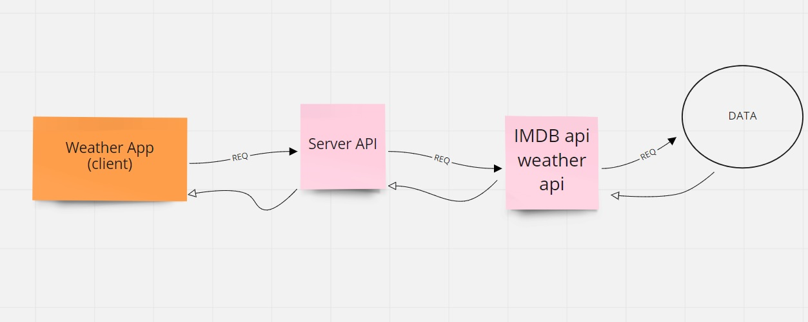

# City Explorer API

**Author**: Miguel Fierro
**Version**: 1.0.0 (increment the patch/fix version number if you make more commits past your first submission)

## Overview
<!-- Provide a high level overview of what this application is and why you are building it, beyond the fact that it's an assignment for this class. (i.e. What's your problem domain?) --> Created a server that has weather information that is sent back to the app

## Getting Started
<!-- What are the steps that a user must take in order to build this app on their own machine and get it running? -->
after searching your City you will be prompted to a server that sends back weather information

## Architecture
<!-- Provide a detailed description of the application design. What technologies (languages, libraries, etc) you're using, and any other relevant design information. -->

## Change Log
<!-- Use this area to document the iterative changes made to your application as each feature is successfully implemented. Use time stamps. Here's an example: -->

11-03-2021 7:48am - Application now has an express server, with a GET route for the location resource.  
11-03-2021 3:59pm - Server is up running and has proper Querys

## Credit and Collaborations
<!-- Give credit (and a link) to other people or resources that helped you build this application. -->
